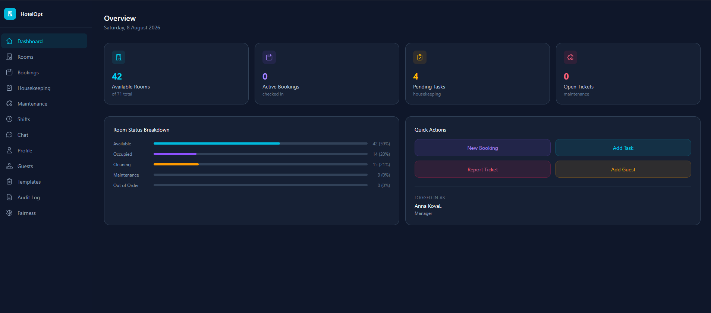
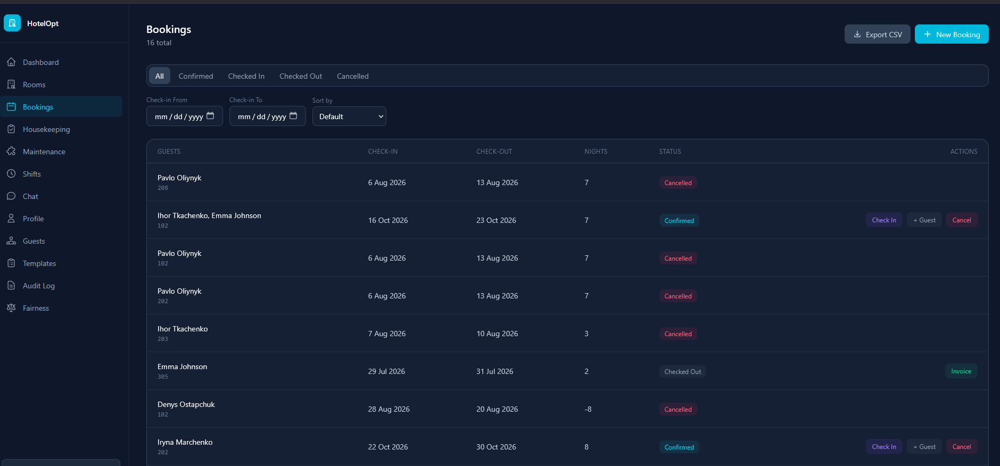
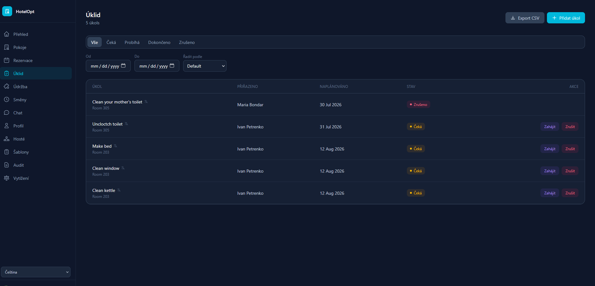

# HotelOpt — Frontend

React web dashboard for HotelOpt, a multi-tenant hotel operations SaaS platform. Built for hotel managers and staff to manage rooms, bookings, housekeeping, maintenance, and more.


## Tech Stack

| | Technology |
|---|---|
| Framework | React 19 |
| Language | TypeScript 6 |
| Bundler | Vite 8 |
| Styling | Tailwind CSS v4 |
| Routing | React Router v8 |
| State | Zustand |
| HTTP | Axios |
| Real-time | SignalR (`@microsoft/signalr`) |
| Notifications | Sonner (toast) |
| i18n | react-i18next |

## Pages

| Route | Page | Access |
|---|---|---|
| `/dashboard` | Overview — KPI cards, room status breakdown, quick actions | All |
| `/rooms` | Room list with status filter, add/edit rooms | All / Manager write |
| `/bookings` | Bookings with check-in/check-out/cancel, guest management, invoices, CSV export | All / Manager write |
| `/tasks` | Housekeeping tasks — start/complete/cancel, filters, CSV export | All / Manager write |
| `/maintenance` | Maintenance tickets — resolve/close/reassign, file attachments | All / Manager write |
| `/shifts` | Staff shift scheduling | All / Manager write |
| `/guests` | Guest profiles CRUD | All / Manager write |
| `/templates` | Task templates per room type — create and apply | All / Manager write |
| `/chat` | Real-time property chat via SignalR | All |
| `/fairness` | Staff workload fairness scores | All |
| `/audit` | Audit log — entity change history | Manager |
| `/profile` | User profile and avatar upload | All |
| `/staff` | Staff management — add, change roles, ban/unban | Owner only |
| `/billing` | Subscription plan management via Stripe | Owner only |
| `/login` | Authentication | Public |

## Project Structure

```
src/
├── api/          # Axios API functions per resource
├── components/   # Shared components (Layout, Sidebar, Pagination, TranslateButton)
├── pages/        # Page components + feature modals grouped by domain
│   ├── bookings/
│   ├── guests/
│   ├── housekeeping/
│   ├── maintenance/
│   ├── rooms/
│   ├── shifts/
│   ├── staff/
│   └── templates/
├── store/        # Zustand stores (authStore, languageStore)
└── types/        # TypeScript interfaces per domain
```

## Key Features

### Authentication
JWT-based auth with refresh token rotation. Token stored in `localStorage`. Axios interceptor attaches the token to every request and redirects to `/login` on 401.

### Multi-tenant & Role-based UI
The logged-in user's `role` and `propertyId` from the JWT drive what's visible:
- **Owner** — sees Billing and Staff Management pages in the sidebar; can add, ban/unban, and change roles of staff
- **Manager** — sees write actions (add, edit, delete, export) on all operational pages
- **Staff** — sees all data but only task/ticket status update actions

### Real-time Chat
SignalR connection to `/hubs/chat` scoped to the user's property. Messages load from REST on mount, then append via the `ReceiveMessage` hub event. Supports per-message translation via DeepL.

### Layout & Responsive Design
All pages use a shared `<Layout>` component with:
- Desktop: static sidebar
- Mobile: hamburger menu + slide-in overlay sidebar
- Tables wrapped in `overflow-x-auto` with `min-w` for horizontal scroll on small screens

### CSV Export
Manager-only export buttons on Bookings and Housekeeping pages. Downloads triggered via `responseType: 'blob'` + programmatic anchor click.

### AI Room Inspection
Upload a room photo to trigger Gemini Vision analysis. Results stored and paginated per room.

### Multilingual UI
Languages supported via `react-i18next`. Language selector in the sidebar bottom. Translation keys cover all UI strings.

## Getting Started

### Prerequisites
- Node.js 18+
- HotelOpt backend running

### Environment Variables

Create a `.env` file in the project root:

```env
VITE_API_URL=http://localhost:5092
VITE_STRIPE_BASIC_PRICE_ID=price_xxxxx
VITE_STRIPE_PRO_PRICE_ID=price_xxxxx
```

### Install & Run

```bash
npm install
npm run dev
```

App will be available at `http://localhost:5173`.

### Build

```bash
npm run build
```

Output goes to `dist/`. For SPA hosting, configure your server to serve `index.html` for all routes.

## State Management

| Store | Contents |
|---|---|
| `authStore` | `token`, `refreshToken`, `user` (persisted in `localStorage`) |
| `languageStore` | Selected UI language (persisted in `localStorage`) |

## API Layer

Each file in `src/api/` corresponds to a backend resource. All calls go through `src/api/client.ts` — a shared Axios instance that:
- Sets `baseURL` from `VITE_API_URL`
- Attaches `Authorization: Bearer <token>` from `localStorage`
- Redirects to `/login` on 401

## Test Credentials

Use these against the seeded database (password: `Test@1234`):

| Email | Role |
|---|---|
| anna.koval@hotel.com | Manager |
| ivan.petrenko@hotel.com | Staff |
| maria.bondar@hotel.com | Staff |
| dmytro.kravchenko@hotel.com | Staff |
